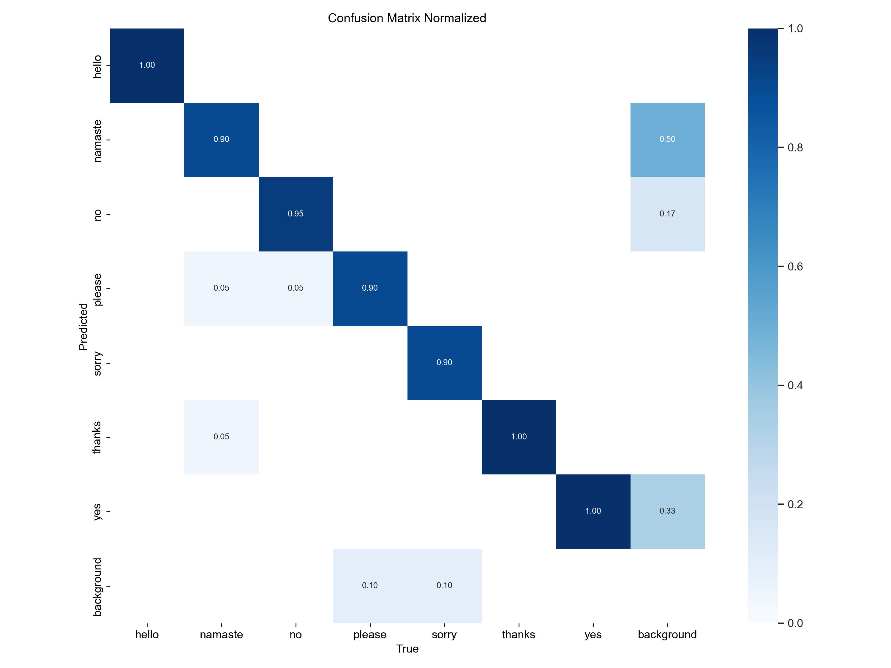
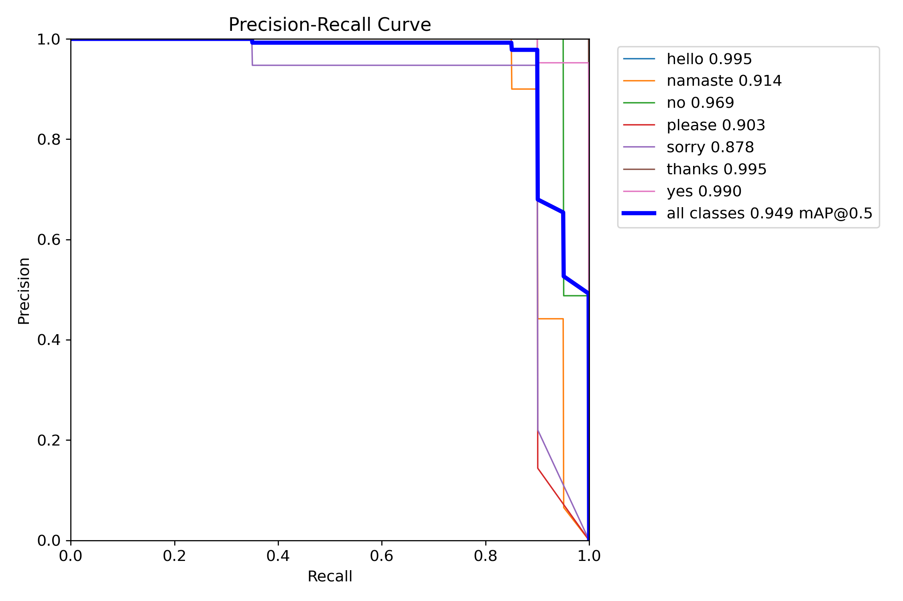
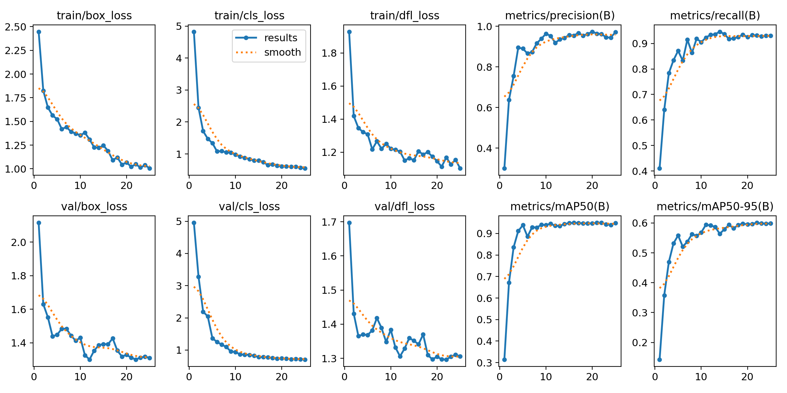
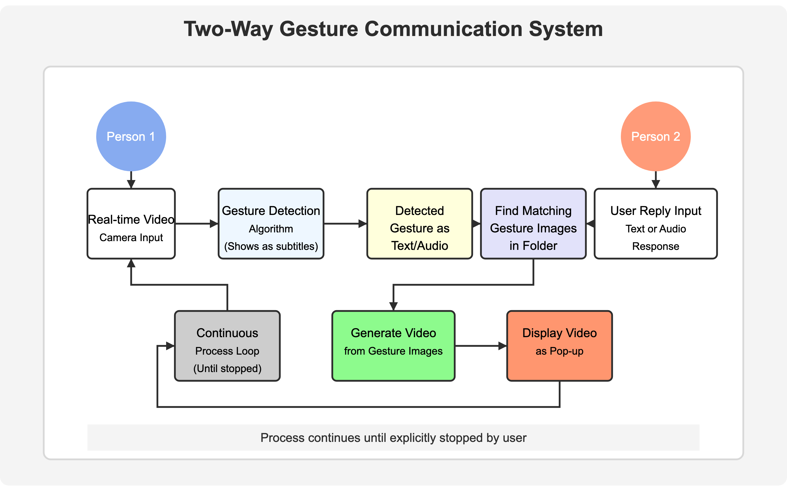

# Sign Language Recognition (SLR) - Two-Way Communication System

## Overview
This project aims to bridge the communication gap between individuals who use sign language and those who do not. While many existing solutions focus only on recognizing sign language and converting it into text or speech, our system extends this by enabling two-way communication. The system allows users to detect gestures in real-time and generate sign-language-based replies.

[Watch the audio reponse demo](https://drive.google.com/file/d/1WWC7SUFA82Se7f29Br_2j89RxJpuJTMZ/view?usp=sharing)


[Watch the text reponse demo](https://drive.google.com/file/d/1QDRsV_kTFOc5u43Y6sIFwv2H7d65m_MJ/view?usp=sharing)


## Features
- **Real-time gesture detection** using YOLOv8.
- **Two-way communication**: Converts recognized text/audio responses into sign language gestures.
- **Lightweight prototype approach**: Uses predefined gesture images to create video responses.
- **Customizable gesture vocabulary**: Users can add new gestures for enhanced communication.
- **Efficient and scalable**: Designed for real-time applications with minimal processing delay.
- **Future Goal**: Train a deep learning model using pose estimation or gesture recognition to automate sign-language translation.

---

## Installation

1. Clone the repository:
   ```bash
   git clone https://github.com/yourusername/SLR_project.git
   cd SLR_project
   ```

2. Install dependencies:
   ```bash
   pip install ultralytics pyqt5 opencv-python openai-whisper
   ```

3. On macOS, install FFmpeg:
   ```bash
   brew install ffmpeg
   ```

---

## Dataset Preparation

1. **Collect Data**  
   Run the script to generate training data:
   ```bash
   python data_generator.py
   ```

2. **Annotate the Data**  
   - Use **CVAT** or another annotation tool to label images for YOLO training.
   - Export the labels in YOLO format.

3. **Ensure File Structure**
   ```
   SLR_project/
   ├── data/
   │   ├── images/
   │   │   ├── train/       # Training images
   │   │   └── val/         # Validation images
   │   ├── labels/
   │   │   ├── train/       # YOLO labels for training
   │   │   └── val/         # YOLO labels for validation
   ```

4. **Configure YOLO Dataset File** - Define dataset paths, number of classes, and training parameters in `config.yaml`.

---

## Training the Model

Run the training script to train YOLO on the dataset:
```bash
python train.py
```


---

## Model Performance  
After training, some key evaluation metrics and visualizations are generated in the `training_results/` folder. These results provide insights into the model’s performance.  

Results from `training_results/exp_1/`:  
- **Confusion Matrix** (normalized):  
    
- **Precision-Recall Curve**:  
    
- **Overall Results Summary**:  
    


---
## Two-Way Communication System

Run the `gesture_communication_app.py`:
```bash
python gesture_communication_app.py
```
1. Detects sign language gestures in real time.
2. Prompts the user to enter a text or audio reply.
3. Searches `seq_folder/` for predefined gesture images corresponding to the text/audio.
4. Generates a reply video in sign language and displays it.

---

## Project Structure

```
SLR_project/
├── data/                # Contains images and labels for training
├── seq_folder/          # Stores predefined gesture images for replies
├── reply/               # Stores generated gesture reply videos
├── training_results/    # Stores trained models and logs
├── config.yaml          # Configuration file for YOLO training
├── train.py             # Script to train the YOLO model
├── predict_real_time.py # Real-time gesture detection
├── gesture_communication_app.py  # Converts text/audio replies to gesture videos
├── requirements.txt     # Dependencies
├── README.md            # Documentation
├── data_generator.py    # Script to collect data
```

---

## Future Work
- Train a **deep learning model** for automated sign-to-text and text-to-sign translation.
- Implement **pose estimation-based gesture recognition** for improved accuracy.
- Develop a **mobile application** to make sign language communication accessible anywhere.

---

## Visualization
The following diagram illustrates the complete workflow of the system:  
  

---

## Acknowledgment
This project was developed under the guidance of **Dr. Alessandro Bruno**, Tenure-Track Assistant Professor in Computer Science at IULM University, Milan, Italy. His mentorship and expertise in deep learning and computer vision played a crucial role in shaping the research and development of this system.

---

## References  
1. [HaGRID - Hand Gesture Recognition Image Dataset](https://openaccess.thecvf.com/content/WACV2024/papers/Kapitanov_HaGRID_--_HAnd_Gesture_Recognition_Image_Dataset_WACV_2024_paper.pdf)  
2. [Computer Vision-Based Hand Gesture Recognition for Human-Robot Interaction: A Review](https://www.mdpi.com/2313-433X/6/8/73)  
3. [CVAT - Computer Vision Annotation Tool](https://www.cvat.ai/)  

---

## License
MIT License

---
